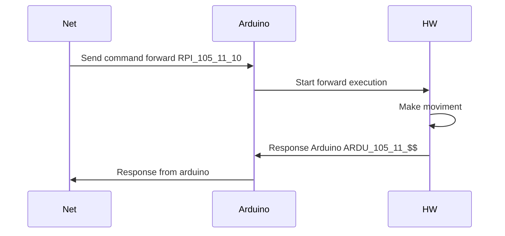

### SCRAP.Net and Arduino Communication Guide

## Overview

SCRAP.Net is the main program that interfaces with the hardware. It breaks down user requests (e.g., "go to the kitchen") into a series of commands executed by Arduino. Arduino receives these commands, interfaces with the hardware, and once the command is completed, it responds to SCRAP.Net. This process continues until the initial task is completed.

## Communication Flow

Here's an example of how a command to move forward 10 cm is sent and processed:



## Message Format

The data transmission format is structured as follows:

`[sender]_[id]_[IdCommand]_[param1]_[param2]_[param3]_[param4]_[end]`

Example:

`RPI_1_11_10_&&`

The data transmission format was selected to provide compatibility with various protocols, including serial and HTTP.

### Components:

- **[sender]**: Message sender (RPI for SCRAP.Net, ARDU for Arduino)
- **[id]**: Auto-incremental command identifier
- **[IdCommand]**: ID of the command to send
- **[param1...4]**: Optional parameters (arrays are split based on SERIAL_ARRAY_SEPARETOR)
- **[end]**: End of message string

## Configuration

These parameters can be configured in the `Configuration.cs` file:

```
public static string SERIAL_SEPARETOR = "_"; 
public static string SERIAL_ARRAY_SEPARETOR = ";"; 
public static string SERIAL_START_MESSAGE_RPI = "RPI"; 
public static string SERIAL_START_MESSAGE_ARDU = "ARDU"; 
public static string SERIAL_END_MESSAGE = "$$\r\n";`
```

`

**IMPORTANT**: The same configurations must be implemented in SCRAP.Arduino and must match, otherwise communication will fail.

## Command Implementation

In SCRAP.Net, all Arduino commands are implemented and declared in the `CommandComunication` class of the `MainRobot.Robot.Comunication` namespace.


## List Command

| Method Name             | Parameter 1                                                                         |
| ----------------------- | ----------------------------------------------------------------------------------- |
| DisableRele1            | 05                                                                                  |
| EnableRele1             | 06                                                                                  |
| DisableRele2            | 07                                                                                  |
| EnableRele2             | 08                                                                                  |
| EnableFakeMoviment      | 09                                                                                  |
| Stop                    | 10                                                                                  |
| Forward                 | 11{Configuration.SERIAL_SEPARETOR}{distance}                                        |
| StartLeftMotor          | 12{Configuration.SERIAL_SEPARETOR}{angle}                                           |
| StartRightMotor         | 13{Configuration.SERIAL_SEPARETOR}{angle}                                           |
| Backward                | 16{Configuration.SERIAL_SEPARETOR}{distance}                                        |
| EnableMoviment          | 21                                                                                  |
| DisableMoviment         | 22                                                                                  |
| GetLevelOfAlimentation  | 32                                                                                  |
| ReadLidar               | 33                                                                                  |
| DisableObstacleFind     | 14                                                                                  |
| EnableObstacleFind      | 15                                                                                  |
| IsInRecharge            | 17                                                                                  |
| OutInRecharge           | 18                                                                                  |
| GetDistanceFrontSensor  | 30                                                                                  |
| GetSourceOfAlimentation | 31                                                                                  |
| MoveServo               | 40{Configuration.SERIAL_SEPARETOR}{numServo}{Configuration.SERIAL_SEPARETOR}{angle} |

1. Always ensure that the configuration in SCRAP.Net and SCRAP.Arduino match.
2. Use meaningful and unique command IDs to avoid confusion.
3. 
