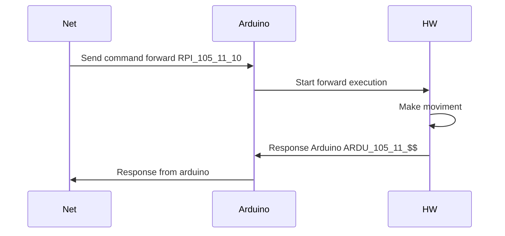

```mermaid
sequenceDiagram
    participant Net
    participant Arduino
    participant HW

    Net->>Arduino: Send command forward RPI_105_11_10
    Arduino->>HW: Start forward execution 
    HW->>HW: Make moviment
    HW->>Arduino: Response Arduino ARDU_105_11_$$
    Arduino->>Net: Response from arduino
```

