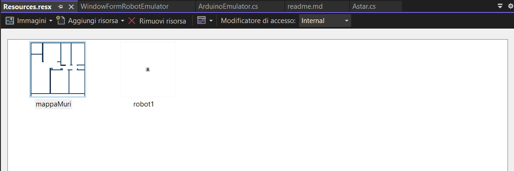

# # Getting Started with SCRAP.Net

This guide will walk you through the process of setting up SCRAP.Net on your local machine. SCRAP.Net is a project that simulates robot communication with Arduino using HTTP protocol.

## Prerequisites

Before you begin, ensure you have the following installed:

- [Git](https://git-scm.com/)
- [Visual Studio 2022](https://visualstudio.microsoft.com/vs/) (or newer) with the .NET workload installed
- [.NET Core 7.0](https://dotnet.microsoft.com/download/dotnet/7.0)
- [eSpeak](https://espeak.sourceforge.net/)

## Installation Steps

### 1. Clone the Repository

1. Open a terminal or command prompt.

2. Navigate to the directory where you want to save the project.

3. Run the following command:
   
   ```
   git clone https://github.com/fra00/SCRAP.Net.git [your_path]
   ```
   
   Replace `[your_path]` with your desired directory path.

### 2. Open the Solution

1. Launch Visual Studio 2022 with administrator privileges.
2. Go to "File" -> "Open" -> "Project/Solution".
3. Navigate to the cloned repository and open the file:
   `[your_path]\SCRAP.Net\Robot\Robot.sln`

### 3. Configure MainRobot Project

#### Edit Configuration.cs

1. Open `Configuration.cs` in the MainRobot project.

2. Set the full path to eSpeak:
   
   ```csharp
   public static string PATH_ESPEAK = "C:\\Program Files (x86)\\eSpeak\\command_line\\";
   ```

3. Modify eSpeak TTS configuration arguments:
   
   ```csharp
   public static string ARGUMENTS_ESPEAK = "-v it -p 20 \"[@textToSpeach]\"";
   ```
   
   Note: `-v it` changes the language to Italian. Remove it for English.

4. Set the Arduino device IP (for emulator, leave as is):
   
   ```csharp
   public static string HTTP_URL_COMUNICATION = "http://192.168.1.238/?cmdData=";
   ```

5. Enable hardware simulation and remote Arduino simulation:
   
   ```csharp
   public static bool FAKE_HW = true;
   public static bool FAKE_REMOTE_ARDUINO = true;
   ```

#### Edit RobotConfiguration.cs

1. Open `RobotConfiguration.cs` in the MainRobot project.

2. Specify the path to load the map:
   
   ```csharp
   public static string MAP_FILE_NAME = "img//mappaMuri.png";
   ```

3. Set the maximum dimensions of the floor plan in cm:
   
   ```csharp
   public static int WIDHT_MAP = 1000;
   public static int HEIGHT_MAP = 1000;
   ```

4. Set the robot's dimensions in cm:
   
   ```csharp
   public static int HALF_WIDTH_ROBOT = 15;
   public static int HALF_HEIGHT_ROBOT = 15;
   ```

5. Leave the minimum movement size unchanged:
   
   ```csharp
   public static int MIN_STEP_FOR_FINDPATH = 10;
   ```

## Creating the Map

The map is a crucial element that you, as the user, need to create. It's used to support the lidar and sensors, and helps speed up pathfinding. Here's how to create and configure the map:

### Map Creation Guidelines

1. **Format**: The map should be a PNG image in black and white.
2. **Content**: 
   - Black areas represent walls or obstacles.
   - White areas represent the floor or navigable space.
3. **Dimensions**: 
   - The image size should be calculated based on the `WIDHT_MAP` and `HEIGHT_MAP` properties in `RobotConfiguration.cs`.
   - In the current configuration, one pixel corresponds to one centimeter.
4. **Creation Tool**: You can use any graphic editor to create this map.

### Steps to Create and Configure the Map

1. Create a black and white PNG image representing your environment. Ensure the dimensions match your `WIDHT_MAP` and `HEIGHT_MAP` settings.

2. Save the map file in your project directory, typically in an `img` folder.

3. Update the `MAP_FILE_NAME` in `RobotConfiguration.cs`:
   
   ```csharp
   public static string MAP_FILE_NAME = "img//yourMapFileName.png";
   ```

4. Ensure the `WIDHT_MAP` and `HEIGHT_MAP` properties in `RobotConfiguration.cs` match your map's dimensions in centimeters:
   
   ```csharp
   public static int WIDHT_MAP = 1000; // if your map is 1000 pixels wide
   public static int HEIGHT_MAP = 1000; // if your map is 1000 pixels tall
   ```

5. Adjust the robot's dimensions if necessary:
   
   ```csharp
   public static int HALF_WIDTH_ROBOT = 15;
   public static int HALF_HEIGHT_ROBOT = 15;
   ```

Remember, the accuracy of your map will directly impact the performance of the pathfinding algorithm and the overall simulation.

## Configure the Emulator

1. Right-click on the WindowFormRobotEmulator project and select "Properties".
2. Go to the "Resources" section.
   
3. Update the map file resource (.png).
   
4. Modify the path where SCRAP.NET is executed (should be the bin folder of the MainRobot project).
   
   

## Run the Projects

1. Right-click on WindowFormRobotEmulator -> Debug -> Start New Instance
2. Right-click on MainRobot -> Debug -> Start New Instance

## Verification

If everything is set up correctly:

1. A shell should open, executing a series of commands.
2. The emulator should launch.

You should see a console window with various commands being executed, and the emulator interface should appear.


