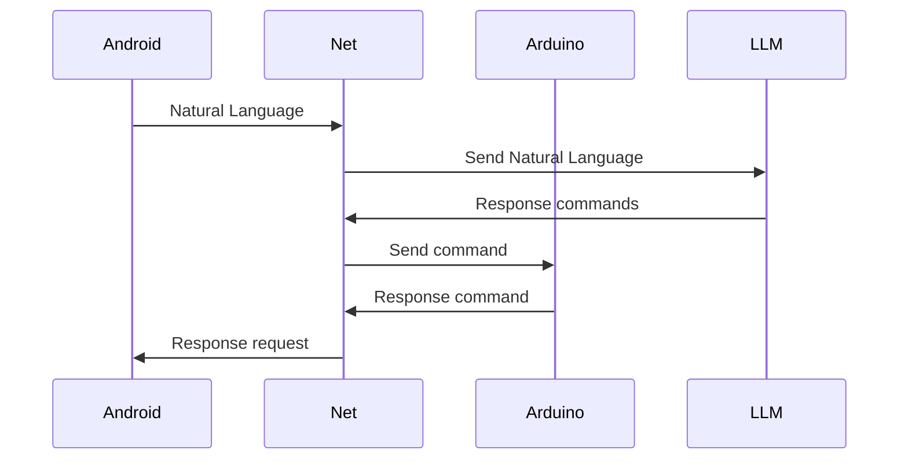

# SCRAP.Net: Control and Planning Platform for Robotic Systems

SCRAP.Net is the core module of the SCRAP platform, designed to provide a flexible architecture for developing autonomous robotic systems. It offers a wide range of features for motion planning, environment interaction, and sensor and actuator integration.

### Key Features:
- Built with .NET Core.
- Cross-platform Compatibility: Runs seamlessly on both Windows and Linux operating systems.
- Advanced Motion Planning:	
	- Efficient pathfinding algorithms for navigation in static and dynamic environments.
	- Handling complex constraints and obstacles.
	- Optimization of paths based on time, energy, or safety criteria.
- LLM Interface:
	- Integration with large language models for natural language understanding and context-aware response generation.
	- Interpretation of complex commands and generation of appropriate actions.
- Modular Architecture:
	- Modular structure that facilitates system expansion and customization.
	- Support for a wide range of sensors and actuators.
	- Accurate environment mapping: Using LIDAR and ultrasonic sensors to create maps of the surrounding environment, enabling robot localization and safer navigation.
- Communications:
	- Communication protocols for synchronization between system components (serial,http).
- Well-defined APIs:
	- RESTful APIs for access to SCRAP.Net features from other systems.

- Benefits:
	- Accelerated Development: Reduction in the time required to develop and test new robotic systems.					
	- Increased Flexibility: Easy adaptation to new applications and requirements.
	- Improved Performance: Optimization of robot performance through advanced planning and control algorithms.

SCRAP.Net offers developers a solid foundation for creating intelligent and reliable robotic systems.

